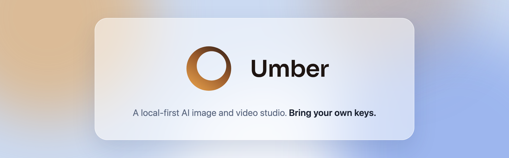

<p align="center">
  
</p>

<p align="center">
  <a href="https://github.com/SiebeBaree/umber/releases/latest"></a>
  <a href="https://github.com/SiebeBaree/umber/releases"></a>
  
  <a href="LICENSE"></a>
</p>

Umber is a desktop app for generating AI images and videos. It puts twelve providers behind one interface: you bring your own API keys, calls go straight from your machine to the provider and everything you generate stays on disk. There is no Umber account, no server in the middle and no subscription.

Works with Google, OpenAI, Black Forest Labs, ByteDance, Kling, Alibaba, Runway, Ideogram, Recraft, MiniMax, xAI and Reve.

## Download

Grab the installer for your machine from the [latest release](https://github.com/SiebeBaree/umber/releases/latest).

| Platform | Asset                                                                          |
| -------- | ------------------------------------------------------------------------------ |
| macOS    | `Umber-<version>-arm64.dmg` (Apple Silicon only, Intel Macs are not supported) |
| Windows  | `Umber-<version>-x64.exe`                                                      |
| Linux    | `Umber-<version>-x86_64.AppImage`                                              |

**macOS.** Signed and notarized. Drag Umber to Applications and open it.

**Windows.** Not signed yet, so SmartScreen shows "Windows protected your PC" on first run. Choose _More info_, then _Run anyway_. The UAC prompt names an unknown publisher for the same reason.

**Linux.** Mark the AppImage executable and run it:

```bash
chmod +x Umber-*.AppImage && ./Umber-*.AppImage
```

The app checks for new releases on launch and tells you in settings when one is available.

## How it works

- **Your keys.** Add API keys for the providers you use. They are encrypted with your OS keychain and never leave your machine except to call the provider itself.
- **Your disk.** Every image and video you generate is saved locally. Nothing is uploaded anywhere else.
- **One interface.** Pick a model, write a prompt and generate. Switching providers does not mean switching apps.

You pay the providers directly for what you generate. Umber itself is free and MIT licensed.

## Building from source

You need Node 24 and pnpm 11 (`corepack enable`).

```bash
pnpm install
pnpm dev
```

See [CONTRIBUTING.md](CONTRIBUTING.md) for the full development setup and [docs/RELEASING.md](docs/RELEASING.md) for how releases are built.

## Security

See [SECURITY.md](SECURITY.md) for how to report a vulnerability.

## License

[MIT](LICENSE)
